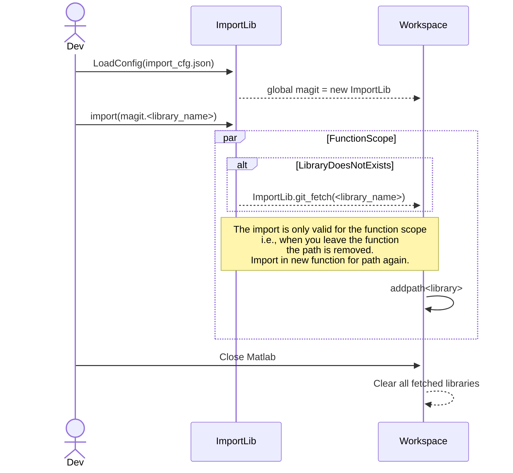

# Summary
MAtlab Git Import Tool (MAgit) is a tool used for the importing of MATLAB libraries off GIT, Bitbucket, Perforce, and local directories. This tool shortcuts, the extra misc. steps required when attempting to import directories and returns a in code python-like interface for imports. In addition, it also manages the MATLAB path to de-conflict code.

# How-to-use
Although the tool provides for P4 interface, its main function is to work with GIT servers. On startup, call `ImportLib` giving it a valid configuration. The `ImportLib` is stored in the global variable `magit`. Call `import(magit.<lib_name>)` within the function to pull the library and set paths. This works recursively, should a library that contains `magit` also attempt to call an `ImportLib` it will add its paths into `magit`.  

# Authentication
Currently, there is no support for github tokens. However, Bitbucket auth has been applied. Change the value within https_token.txt to your token value.

# Known Issues
Workspace Configuration goes based off the first config that is read in. That is to say workspaces, will not recursively add up.
